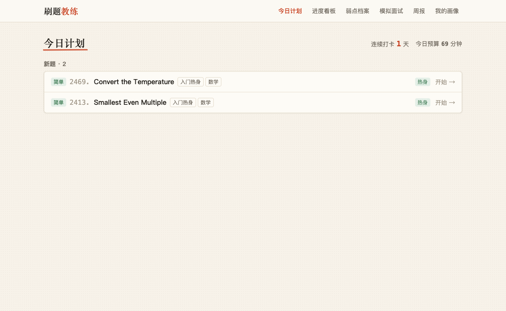
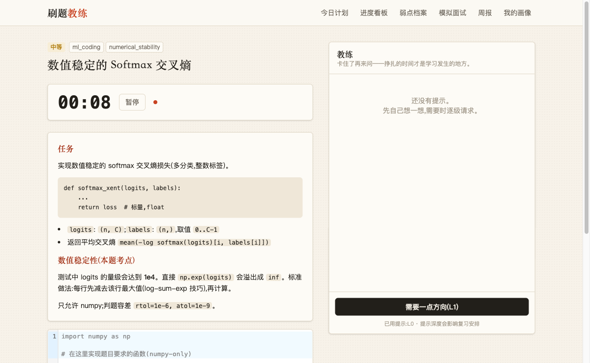
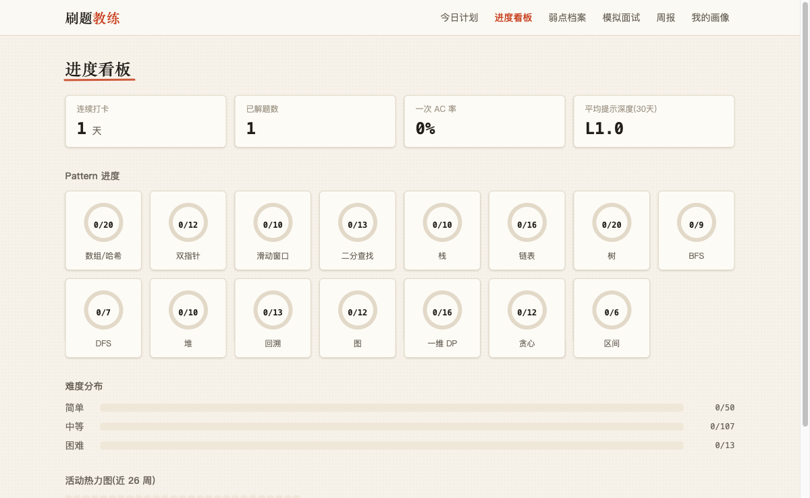
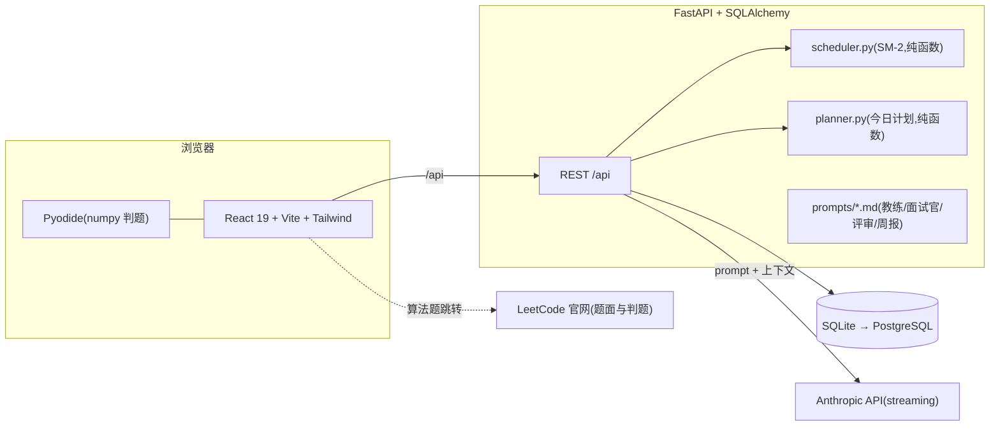

# LeetCode Coach · 刷题教练

[](https://github.com/JunbaoLiang/leetcode-coach/actions/workflows/ci.yml)
[](LICENSE)

中文 · [English](#english)

开源的、AI 驱动的算法面试教练。核心主张:**AI 的作用不是帮你更快地解题,而是帮你记住更多做过的题、修复真实的弱点。**


## 四大支柱

1. **自适应课程** — 按画像(背景/目标赛道/时间预算)生成学习路径:MLE、AI4S、SWE 应届、转行者四套模板,各自不同的算法:ML 配比与难度上限,零基础可加官方入门热身。
2. **教练式反馈** — L1→L4 渐进提示(逐级手动请求、绝不甩答案)、AC 代码结构化 review、teach-back 讲解关卡(讲不明白不算掌握)。
3. **证据驱动的间隔复习** — 改造版 SM-2:复习间隔由提示用量、判题失败次数、是否一次 AC 等客观证据合成,不靠单纯自评;重要题复习更勤。
4. **模拟面试** — 面试官人格全程不出戏、不提示、不确认对错;45 分钟倒计时;事后 6 维 rubric 评分 + 引用对话轮次的复盘 + 补练处方。

**差异化**:ML coding 赛道 —— 10 道原创 numpy 手写题(线性回归 → 多头注意力),浏览器内 Pyodide 判题,失败只报形状与容差、不泄露答案。

| 今日计划 | ML 手写题工作台 | 进度看板 |
|---|---|---|
|  |  |  |

## 架构



关键设计(详见 [PLAN.md](PLAN.md) 与 [docs/decisions.md](docs/decisions.md)):

- **不镜像 LeetCode 题面**:算法题只存元数据(190 题全部经官方 GraphQL 逐条核对),做题发生在官网,coach 负责做题前/中/后;
- **刻意摩擦**:提示必须逐级手动要,记录表单不许跳过自评——挣扎时间才是学习发生的地方;
- **LLM 状态可读**:所有评估输出结构化 JSON 落库,prompt 以 markdown 文件迭代;
- **可回滚**:CI 保证 main 每个提交可运行;Alembic 迁移全部带 `downgrade()`;`make backup/restore` 提供数据级快照回滚。

## 本地启动

前置:Python 3.11+、Node 20+。本地默认**单用户免登录**。

```bash
# 后端(http://localhost:8000)
cd backend && python3.12 -m venv .venv && .venv/bin/pip install -e ".[dev]"
.venv/bin/alembic upgrade head && .venv/bin/python -m seed.import_seed
.venv/bin/uvicorn app.main:app --reload --port 8000

# 前端(http://localhost:5173,已代理 /api)
cd frontend && npm install && npm run dev
```

LLM 功能需要 `backend/.env` 中配置 `ANTHROPIC_API_KEY`(模板见 `backend/.env.example`)。

## 部署(免费档)

前端 Vercel + 后端 Railway/Render + 数据库 Neon(PostgreSQL)。

**① 后端(Railway 或 Render)**

- 根目录(Root Directory)选 `backend/`
- Build 命令:**留空**(平台检测到 `requirements.txt` 会自动安装依赖并配好 PATH)
- 启动命令(迁移与种子导入是幂等的,直接串在启动里最省心):

  ```
  alembic upgrade head && python -m seed.import_seed && uvicorn app.main:app --host 0.0.0.0 --port $PORT
  ```
- 环境变量:

| 变量 | 值 |
|---|---|
| `DATABASE_URL` | Neon 连接串(`postgresql://...`) |
| `ANTHROPIC_API_KEY` | 你的 key |
| `AUTH_ENABLED` | `true` |
| `GITHUB_CLIENT_ID` / `GITHUB_CLIENT_SECRET` | 见下 ③ |
| `SESSION_SECRET` | `openssl rand -hex 32` 生成 |
| `PUBLIC_BASE_URL` | 你的前端域名(如 `https://xxx.vercel.app`) |

**② 前端(Vercel)**

- 项目根目录选 `frontend/`,框架 Vite,无需环境变量
- 把 `frontend/vercel.json` 里的 `YOUR-BACKEND-DOMAIN` 改成 ① 的后端域名——所有 `/api` 请求经 Vercel 同源代理转发,cookie 天然生效

**③ GitHub OAuth App**

- GitHub → Settings → Developer settings → OAuth Apps → New
- Homepage:前端域名;**Authorization callback URL:`https://<前端域名>/api/auth/callback`**(走 Vercel 代理,这样会话 cookie 落在前端域名上)

发布节奏与 tag 对齐;回滚顺序:先 `alembic downgrade` 再回退代码(详见 PLAN §13)。

## 文档

- [PLAN.md](PLAN.md) — 项目唯一权威规格(愿景/数据模型/算法/里程碑)
- [docs/decisions.md](docs/decisions.md) — 技术决策记录
- [docs/blog-draft.md](docs/blog-draft.md) — 技术博客草稿:设计决策与调研综述
- [CONTRIBUTING.md](CONTRIBUTING.md) — 贡献指南与红线

---

## English

An open-source, AI-powered coach for algorithm interviews. The thesis: **AI shouldn't solve problems faster for you — it should help you retain more of what you've solved and fix your real weaknesses.**

**Four pillars**

1. **Adaptive curriculum** — four track templates (MLE / AI-for-Science / SWE new-grad / career-switcher) with different algorithm-to-ML ratios, difficulty ceilings, and an optional official primers warm-up for beginners.
2. **Coach-style feedback** — progressive hints L1→L4 (manually requested, never volunteered), structured AC-code review, and a teach-back gate: if you can't explain it, you haven't mastered it.
3. **Evidence-driven spaced repetition** — a modified SM-2 where review intervals are synthesized from objective evidence (hint depth used, judge failures, first-try AC) rather than self-rating alone.
4. **Mock interviews** — an interviewer persona that never breaks character, never hints, never confirms; 45-minute countdown; afterwards a 6-dimension rubric, a postmortem citing specific dialogue turns, and drill prescriptions.

**Differentiators**: an ML-coding track — 10 original numpy-only problems (linear regression → multi-head attention) judged **in the browser via Pyodide**; failure messages reveal shapes and tolerances only, never answers. Problem metadata only (statements stay on LeetCode; all 190 entries verified against the official GraphQL API).

**Stack**: FastAPI + SQLAlchemy + SQLite/PostgreSQL · React 19 + Vite + Tailwind + CodeMirror 6 · Anthropic API (streaming) · Pyodide.

**Quick start**: see [本地启动](#本地启动) above — the commands are identical. Local dev runs single-user with no login; production enables GitHub OAuth multi-user via `AUTH_ENABLED=true` (deployment guide: [部署](#部署免费档)).

License: [MIT](LICENSE) · Contributing: [CONTRIBUTING.md](CONTRIBUTING.md)
